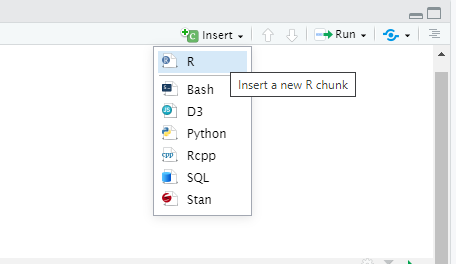
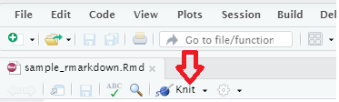
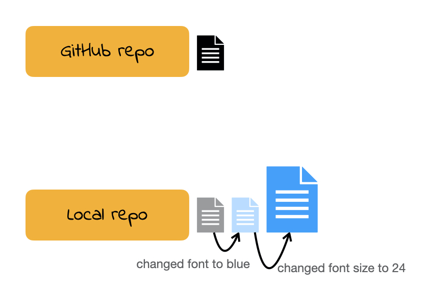
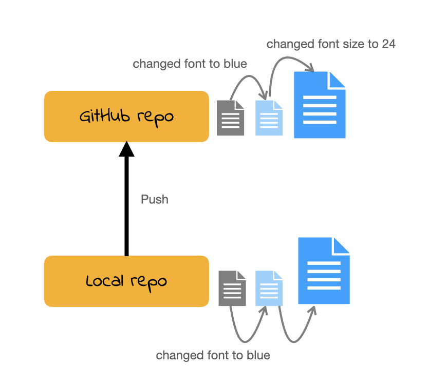

class: title-slide

```{r child = "../setup.Rmd"}
```

<br>
<br>
.right-panel[ 

# `r rmarkdown::metadata$title`
## `r rmarkdown::metadata$author`
]

---


class: center middle


        
Mine Dogucu  
Assistant Professor of Teaching 
<br>
Department of Statistics 

.large[`r fontawesome::fa(name = "university")`] <a href = "https://www.scicompr/people.html">M 10 - 11 am, F 3 - 4 pm</a>  
.large[`r fontawesome::fa(name = "envelope")`] <a href = "mailto:mdogucu@uci.edu">mdogucu@uci.edu</a>  
.large[`r fontawesome::fa(name = "twitter")`] <a href = "http://twitter.com/MineDogucu">MineDogucu</a>  
.large[`r fontawesome::fa(name = "github")`] <a href = "http://github.com/mdogucu">mdogucu</a>  


---


class: center middle


        

PhD Student
<br>
Department of Statistics 

.large[`r fontawesome::fa(name = "envelope")`] <a href = "mailto:xiwenj@uci.edu">xiwenj@uci.edu</a>  
.large[`r fontawesome::fa(name = "github")`] <a href = "https://github.com/XiwenJiang">XiwenJiang</a> 

---

class: middle 

## Goals

- Introduction to the Course

- Introduction to R and RStudio

- Introduction to R Markdown

- Introduction to Git and GitHub


---

class: inverse center middle

.font75[Introduction the Course]

---

class: middle center

By the end of this program you should be able to adopt reproducible computing workflows.

---

class: middle center

By the end of this program you should be able to adopt reproducible computing workflows in R.

---

class: middle 

By the end of this course you should be able to adopt reproducible computing workflows in R for all your scientific work (e.g. data management, analysis, dissemination).

--

I may not teach you every single detail on the topic but you will gain enough foundations to tailor it to your future work.

---

class: middle

## End Products

- Personal website (will come as homework)
- R package
- Final project of your own choice

---
class: inverse center middle

.font75[Introduction to R]

---


class: middle center

<video width="80%" height="45%%" align = "center" controls>
  <source src="screencast/01a-hello-world.mp4" type="video/mp4">
</video>


---

class: inverse middle center

.font100[R review]

---

class: middle 

## Object assignment operator

```{r}
birth_year <- 1950
```


--

|                            | Windows        | Mac              |
|----------------------------|----------------|------------------|
| Shortcut     | Alt + -        | Option + -       |


---

class: middle

## R is case-sensitive


```{r error=TRUE}

my_age <- 2020 - birth_year

My_age
```

--


---


class: middle

If something comes in quotes, it is not defined in R. 


```{r}

ages <- c(25, my_age, 32)

names <- c("Menglin", "Mine", "Rafael")

data.frame(age = ages, name = names)
```

---


## Vocabulary

```{r eval=FALSE}
do(something)
```

`do()` is a function;   
`something` is the argument of the function.
--

```{r eval=FALSE}
do(something, colorful)
```

`do()` is a function;   
`something` is the first argument of the function;   
`colorful` is the second argument of the function.

---

class: middle

## Getting Help

In order to get any help we can use `?` followed by function (or object) name. 

```{r eval=FALSE}
?c
```


---

## tidyverse_style_guide

>canyoureadthissentence?


--
    
.pull-right[

```{r eval = FALSE}
age <- c(6, 9, 15)

data.frame(age_kid = age)
```

]

--

.pull-left[

After function names do not leave any spaces.

Before and after operators (e.g. <-, =) leave spaces. 

Put a space after a comma, **not** before. 

Object names are all lower case, with words separated by an underscore.

]

[The tidyverse style guide](https://style.tidyverse.org/)

---

class: middle center


#### RStudio Setup

<video width="80%" height="45%%" align = "center" controls>
  <source src="screencast/01b-rstudio-setup.mp4" type="video/mp4">
</video>

---

class: inverse center middle

.font75[Introduction to R Markdown]

---

class: inverse middle 

.font150[markup languages]

---

class: middle


## LaTeX


<br>


.pull-left[
```
$\frac{3}{5}$
```
]

.pull-right[

$\frac{3}{5}$

]

---
class: middle

## HTML (Hypertext Markup Language)

<br>


.pull-left[

```
<a href = "http://minedogucu.com">
  Mine Dogucu</a>
```
]

.pull-right[

<a href = "http://minedogucu.com">Mine Dogucu</a>

]

---
class: middle


## markdown `r fontawesome::fa(name = "markdown", fill = "#4d2600")`

<br>


.pull-left[


```
[Mine Dogucu](http://minedogucu.com)
```
]

.pull-right[

[Mine Dogucu](http://minedogucu.com)
]

---
class: inverse middle center

.font150[R Markdown]

---

class: inverse middle center

.font150[~~R~~ Markdown]

---

## markdown `r fontawesome::fa(name = "markdown", fill = "#4d2600")`

<br>


.pull-left[

```
_Hello world_ 

__Hello world__

~~Hello world~~ 
```
]

.pull-right[

_Hello world_ 

__Hello world__

~~Hello world~~ 
]

---

class: inverse middle

.font100[`r fontawesome::fa(name = "r-project", fill = "white")` = .R file]

.font100[`r fontawesome::fa(name = "markdown", fill = "white")` = .md file]

.font100[`r fontawesome::fa(name = "r-project", fill = "white")` + `r fontawesome::fa(name = "markdown", fill = "white")` = .Rmd file]

---
class: center middle

#### markdown document

<video width="80%" height="45%%" align = "center" controls>
  <source src="screencast/01c-rmd-md.mp4" type="video/mp4">
</video>

---

class: center middle

#### R Markdown document

<video width="80%" height="45%%" align = "center" controls>
  <source src="screencast/01d-rmd-rmd.mp4" type="video/mp4">
</video>

---

class: center middle

#### YAML (Yet Another Markup Language)

<video width="80%" height="45%%" align = "center" controls>
  <source src="screencast/01e-rmd-yaml.mp4" type="video/mp4">
</video>

---

### More YAML

```yaml
output:pdf_document
```

--

```yaml
output:
  html_document:
    toc: true
```
  
--

```yaml
output:
  html_document:
    fig_width: 7
    fig_height: 6
```

More in the [R Markdown book](https://bookdown.org/yihui/rmarkdown/html-document.html)

---


class: center middle

#### Parameterized Reporting in R Markdown

<video width="80%" height="45%%" align = "center" controls>
  <source src="screencast/01f-rmd-params.mp4" type="video/mp4">
</video>
---

```{r echo=FALSE, out.width='100%'}

```

---

class: center middle

### Starting a New R Markdown document

File > New File > R Markdown

---

class: center middle

## Add Chunk

```{r echo=FALSE, out.width='50%'}

```

---

class: center middle

## Run the Current Chunk

```{r echo=FALSE, out.width='20%'}
knitr::include_graphics('img/run-code.png')
```

---

class: center middle 

## Knit

```{r echo=FALSE, out.width='50%'}

```

---

class: middle center


## Shortcuts

|                            | Windows          | Mac              |
|----------------------------|------------------|------------------|
| add chunk                  | Ctrl + Alt + I   | Cmd + Option + I |
| run the current chunk      | Ctrl + Alt + C   | Cmd + Option + C |
| run current line/selection | Ctrl + Enter     | Cmd + Return     |
| knit                       | Ctrl + Shift + K | Cmd + Shift + K  |


---
class: center middle 

## (some) Chunk Options 

<table align = "center">

<tr>

<td>echo = FALSE</td>
<td>hides the code</td>

</tr>

<tr>

<td>message = FALSE</td>
<td>hides messages</td>

</tr>

<tr>

<td>warning = FALSE</td>
<td>hides warning</td>

</tr>

<tr>

<td>error = TRUE</td>
<td>renders despite errors and displays the error</td>

</tr>

<tr>

<td>eval = FALSE</td>
<td>code is not evaluated</td>

</tr>

<tr>

<td> cache = TRUE</td>
<td>will not run if it has been run before and <br> the output from previous run would be used</td>

</tr>

</table>
 

---

class: middle

## Slides

Slides that you are currently looking at are also written in R Markdown. You can take a look at them on [GitHub repo](https://github.com/stats295r-fa21/website/tree/master/slides) for the course website. They are made with xaringan package which we will talk more about later.

---
class: inverse center middle

.font75[Introduction to Git and GitHub]

---

class: center middle 

```{r echo=FALSE, out.width='80%'}

```

---

Who uses GitHub?

```{r echo=FALSE, out.width='100%'}

```

---

Who uses GitHub?

```{r echo=FALSE, out.width='100%'}

```

---

class: middle

## Version control

hw1

--

hw1_final

--

hw1_final2

--

hw1_final3

--

hw1_finalwithfinalimages

--

hw1_finalestfinal

---

class: middle 

What if we tracked our file with a better names for each version?

--

hw1 **added name**

--

hw1 **added question 1 image**

--

hw1 **changed name/ added group mate**

--

hw1 **added first draft of all questions**

--

We will call the descriptions in bold **commit** messages.

---
class: middle 

```{r echo=FALSE, out.width='40%',fig.align='center'}
knitr::include_graphics('img/github-illustration.002.jpeg')
```

---
class: middle 

```{r echo=FALSE, out.width='55%', fig.align='center'}

```

---
class: middle 

```{r echo=FALSE, out.width='55%', fig.align='center'}

```

---
class: middle 

```{r echo=FALSE, out.width='55%', fig.align='center'}

```

---
class: middle 

```{r echo=FALSE, out.width='55%', fig.align='center'}

```

---
class: middle 

```{r echo=FALSE, out.width='50%', fig.align='center'}

```
---

class: middle 

### Art of commit messages that is learned with practice

**Commit often** but not too often. If in doubt, commit often.

---
class: center middle


<video width="80%" height="45%%" align = "center" controls>
  <source src="screencast/01g-intro-github-screen.mp4" type="video/mp4">
</video>

---

class: middle

## Cloning a repo

**repo** is a short form of repository. Repositories contain all of your project's files as well as each file's revision history.

For this class our weekly repos (lecture code, quiz code etc.) are hosted on Github. 

To **clone** a GitHub repo to our computer, we first copy the cloning link as shown in screencast then start an RStudio project using that link.  

**Cloning** a repo pulls (downloads) all the elements of a repo available at that specific time. 

---

class: middle

## Commits

Once you make changes to your repo (e.g. take notes during lecture, answer a quiz question). you can take a snapshot of your changes with a commit.

This way if you ever have to go back in version history you have your older commits to get back to. 
This is especially useful, for instance, if you want to go back to an earlier solution you have committed.

---

class: middle

## Push

All the commits you make will initially be local (i.e. on your own computer). 

In order for me to see your commits and your final submission on any assignment, you have to **push** your commits. In other words upload your files at the stage in that specific time.


---

class: middle

## (An incomplete) Git/GitHub glossary

**Git:** is software for tracking changes in any set of files

**GitHub:** is an internet host for Git projects.

**repo:** is a short form of repository. Repositories contain all of your project's files as well as each file's revision history.

**clone:** Cloning a repo **pulls** (downloads) all the elements of a repo available at that specific time. 

**commit:** A snapshot of your repo at a specific point in time. We distinguish each commit with a **commit message**. 

**push:** Uploads the latest "committed" state of your repo to GitHub.


---

class:  middle center

.font100[git it?]


