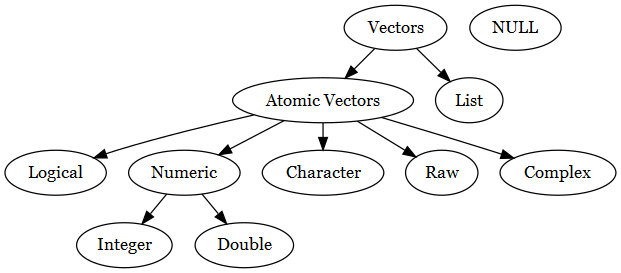

class: title-slide

```{r child = "../setup.Rmd"}
```

```{r echo = FALSE, message=FALSE}
library(DiagrammeR)
library(DiagrammeRsvg)
library(rsvg)
library(tidyverse)
library(fivethirtyeight)
library(bayesrules)
library(fivethirtyeight)
library(titanic)
library(janitor)
```

<br>
<br>
.right-panel[ 

# `r rmarkdown::metadata$title`
## `r rmarkdown::metadata$author`
]

---

class: middle

## Goals

- Data Frames (and Tibbles)
- Vectors (and lists)
- The pipe operator
- Changing variable names & types
- Summarizing variables


---

class: center middle

## Review

---

class: middle

## Data Frames

A typical data frame has 

`columns` that each represents a variable.  
`rows` that each represents an observation.

---

## Functions for Data Frames

```{r}
head(mtcars)
```

---

## Functions for Data Frames

```{r}
tail(mtcars)
```

---

## Functions for Data Frames

```{r}
glimpse(mtcars)
```

---

## Functions for Data Frames

Note that `summary()` function is useful beyond data frames.

```{r}
summary(mtcars)
```
---

### `Data Frames` vs. Tibbles

```{r echo=FALSE}
mtcars
```

---

### Data Frames vs. `Tibbles`

```{r echo=FALSE}
as_tibble(mtcars)
```

---

class: middle inverse center
.font75[Vectors in R]

---

## Numeric Vectors (integer and double)

`SibSp` Number of Siblings/Spouses Aboard on Titanic

```{r echo=FALSE}
select(as_tibble(titanic_train), SibSp, Fare)
```

---

## Character Vectors

`SibSp` Number of Siblings/Spouses Aboard on Titanic

```{r echo=FALSE}
select(as_tibble(titanic_train), Name, Ticket)
```

---

## Logical

Do you have any children under eighteen?

```{r echo=FALSE}
select(flying, children_under_18)
```

---

## Factor

a.k.a. categorical variable in statistics

```{r echo=FALSE}
select(as_tibble(titanic_train), 
       Embarked) %>% 
  mutate(Embarked = case_when(
    Embarked == "S" ~ "Southampton",
    Embarked == "Q" ~ "Queenstown",
    Embarked == "C" ~ "Cherbourg"))
```

---

## Ordered factor

Is it rude to recline your seat on a plane?

```{r echo = FALSE}
select(flying, recline_rude)
```


---

class: middle center 

## Vector Types in R


```{r echo = FALSE, fig.align='center'}
diagram_small <- grViz("
    digraph {
        # graph aesthetics
        graph [ranksep = 0.3]
        # node definitions with substituted label text
        1 [label = 'Vectors']
        2 [label = 'NULL']
        3 [label = 'Atomic Vectors']
        
        4 [label =
        'List']
        5[label='Logical']
        6[label='Numeric']
        7[label = 'Character']
        8[label = 'Integer']
        9[label = 'Double']
        10[label = 'Raw']
        11[label = 'Complex']
        
        # edge definitions with the node IDs
        1  2
        1 -> 3
        1 -> 4
        3 -> 5
        3 -> 6
        3 -> 7
        6 -> 8
        6 ->9
        3 -> 10
        3 -> 11
    }
")
tmp <- capture.output(rsvg_png(charToRaw(export_svg(diagram_small)),'img/diagram_small.png'))
 
```

.footnote[Missing values are represented with NA in R. NULL represents anything that is undefined. Absence of a vector is often represented by NULL.]
---

class: middle

## Augmented Vectors

Augmented vectors are atomic vectors that have additional metadata. 

`factor` is an integer vector with levels.

`ordered factor` is an integer vector with ordered levels.

`date` is a numeric vector.

`date-time` is numeric vector.

---

class: middle

### Creating Vectors with Multiple Elements


```{r}
78:83
```


```{r}
3.4:8.5
```

---

class: middle

### Creating Vectors with Multiple Elements

.pull-left[

```{r}
# A numeric vector
c(5, 7, 8) 
```


```{r}
# A character vector
c("Hello", "World", "today") 
```

]

.pull-right[

```{r}
# A character vector
c("Hello", "World", 5) 
```

Note that even if we use numeric and character values within a (atomic) vector, a (atomic) vector has only one type.
]
---

class: middle

### Creating Vectors with Multiple Elements


```{r}
seq(from = 2, to = 4, by = 0.3)
```

```{r}
rep(1, times = 20)
```

.footnote[Note that in the R output the vector elements are enumerated at the beginning of each line.]

---

### Selecting elements of a vector

```{r}
names <- c("Menglin", "James", "Gloria")

names[2] 

names[2:3]

names[-2]
```


---

class: middle

### Selecting Vectors from a Data Frame or Tibble

```{r}
mtcars$mpg
```

---

class: middle

### Selecting Vectors from a Data Frame or Tibble

```{r}
mtcars[1,] # selects first row
```

---

class: middle

### Selecting Vectors from a Data Frame or Tibble

```{r}
mtcars[1:3,] # selects first through third row
```

---

class: middle

### Selecting Vectors from a Data Frame or Tibble

```{r}
mtcars[,5] # selects fifth column
```


---

class: middle

### Selecting Vectors from a Data Frame or Tibble

```{r}
mtcars[1:2,5] # selects fifth column of first and second row
```

---

class: inverse middle center

.font75[Lists]

---

class: middle


```{r}
my_list <- list("Gloria",
                7, 
                c(8,15.56,15, 16), 
                c(TRUE, FALSE), 
                mtcars)

```

---

class: middle

```{r}
my_list
```

---

### Selecting elements from a list

```{r}
my_list[[5]]
```

---

### Selecting elements from a list

```{r}
my_list[[5]][2]
```

---

### Selecting elements from a list

```{r}
my_list[[3]][3]
```

---

### 

```{r}
small_list <- list(3, 
                 c(5, 2, 5.6))
long_list <- list("STATS 295",
     small_list)
long_list
```

---

## Checking structure of R objects

```{r}
str(my_list)
```


---

## Checking structure of R objects

```{r}
str(long_list)
```

---

class: inverse middle center

.font75[The pipe operator]

---

class: middle 

.font50[Three solutions to a single problem]


---

class: middle

What is the average of 4, 8, 16 approximately?

---

class: middle

1.What is the average of **4, 8, 16** approximately?

---

class: middle

2.What is the **average** of 4, 8, 16 approximately?

---

class: middle

3.What is the average of 4, 8, 16 **approximately**?

---

class: middle 

.font50[Solution 1: Functions within Functions]

---

```{r}
c(4, 8, 16)
```

--

<hr>

```{r}
mean(c(4, 8, 16))
```

--

<hr>

```{r}
round(mean(c(4, 8, 16)))
```

---

class: middle

**Problem with writing functions within functions**

Things will get messy and more difficult to read and debug as we deal with more complex operations on data.

---

class: middle 

.font50[Solution 2: Creating Objects]

---

class: middle

```{r}
numbers <- c(4, 8, 16)
numbers
```

--

<hr>

```{r}
avg_number <- mean(numbers)
avg_number
```

--

<hr>

```{r}
round(avg_number)
```

---

class: middle

**Problem with creating many objects**

We will end up with too many objects in `Environment`. 

---

class: middle 

.font50[Solution 3: The (forward) Pipe Operator %>% ]

---

class: middle

.font75[Shortcut: <br>Ctrl (Command) + Shift + M]

---
class: middle

.pull-left[
```{r}
c(4, 8, 16) %>% 
  mean() %>% 
  round()
```
<br>
]

.pull-right[

Combine 4, 8, and 16 `and then`  
Take the mean   `and then`  
Round the output


]

--

.pull-right[The output of a function becomes the first argument of the next function].


---

class: middle

Recall composite functions such as $f \circ g(x)$?

--

Now we have $f \circ g \circ h (x)$ or `round(mean(c(4, 8, 16)))`

--

.pull-left[

```{r eval = FALSE}
h(x) %>% 
  g() %>% 
  f()
```

]

.pull-right[

```{r eval = FALSE}
c(4, 8, 16) %>% 
  mean() %>% 
  round()
```

]

---

## Fun fact

.left-panel[
```{r message = FALSE}
library(magrittr)
```

```{r echo=FALSE, out.width='40%', fig.align='center'}
knitr::include_graphics('img/pipe-logo.png')
```
]

.right-panel[
[Treachery of Images](https://en.wikipedia.org/wiki/The_Treachery_of_Images#/media/File:MagrittePipe.jpg) by René Magritte

```{r echo=FALSE, out.width='70%', fig.align='center'}
knitr::include_graphics('img/magritte.jpg')
```

.footnote[Image for Treachery of Images is from University of Alabama [website](https://tcf.ua.edu/Classes/Jbutler/T311/Modernism.htm) and used under fair use for educational purposes.]
]

---

class: inverse middle

.font75[Changing Variable Names and Types]

```{r echo=FALSE, message= FALSE}
lapd <- read_csv(here::here("slides/data/Police_Payroll.csv")) %>% 
  filter(Year == 2018) %>% 
  select(`Department Title`, `Base Pay`, `Employment Type`)
```

---

class: middle

```{r}
glimpse(lapd)
```

---

## Cleaning variable names

`clean_names()` changes variable names consistent with the tidyverse style.

```{r}
clean_names(lapd)
```


---

## Renaming variables

```{r}
clean_names(lapd) %>% 
  rename(dept_title = department_title)
```

---

## Renaming variables

More than one variable within a single `rename()` function can be renamed.

```{r}
clean_names(lapd) %>% 
  rename(dept_title = department_title,
         emp_type = employment_type)
```

---

class: middle

### Making changes to variable types 

`mutate()` function helps make create new variables or make changes to existing ones.

```{r}
clean_names(lapd) %>% 
  rename(dept_title = department_title,
         emp_type = employment_type) %>% 
  mutate(emp_type2 = as.factor(emp_type))
```

---

class: middle

### Making changes to variable types

We normally would not call the new variable as `emp_type2` instead we would call it `emp_type` to override the older version.

```{r}
clean_names(lapd) %>% 
  rename(dept_title = department_title,
         emp_type = employment_type) %>% 
  mutate(emp_type = as.factor(emp_type))
```

---

class: middle

### Making changes to variable types

Changes to other vector types are also possible with the following functions

`as.numeric()`  
`as.double()`  
`as.integer()`  
`as.character()`  
`as.logical()`  


---

Why does lapd object does not reflect any of the data cleaning that we have accomplished? 

```{r}
lapd
```

---

class: middle

We can overwrite the old `lapd` object by assigning the cleaner version of `lapd`

```{r}
lapd <- clean_names(lapd) %>% 
  rename(dept_title = department_title,
         emp_type = employment_type) %>% 
  mutate(emp_type = as.factor(emp_type))
```


---

class: middle

```{r}
lapd
```


---

class: middle center inverse

.font75[Summarizing Numeric Variables]


---

class: middle

## Numerical Descriptive Functions 

`mean()`  
`median()`  
`sd()`  
`var()`  
`min()` 
`max()`
`quantile()`

---

class: middle
## Mean

.pull-left[
```{r}
summarize(lapd, 
          mean(base_pay))
```
]

--

.pull-right[

```{r}
mean(lapd$base_pay)
```

]

---

class: middle 

We can get multiple summaries with one `summarize()` function.

```{r}
summarize(lapd,
          mean(base_pay),
          median(base_pay))
```

Note how the variables names in this table is not easy to read. 

---

class: middle 

In order to display the variable names more legibly in the output, we can assign variable names to numerical summaries (e.g. `mean_base_pay`).

```{r}
summarize(lapd,
          mean_base_pay = mean(base_pay),
          med_base_pay = median(base_pay))
```


