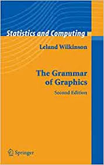
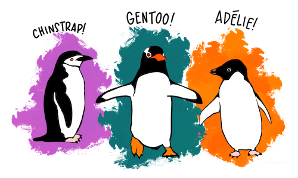
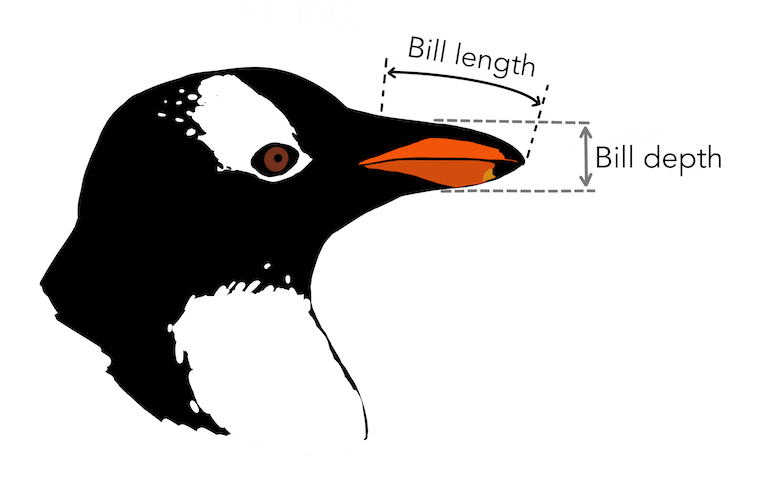
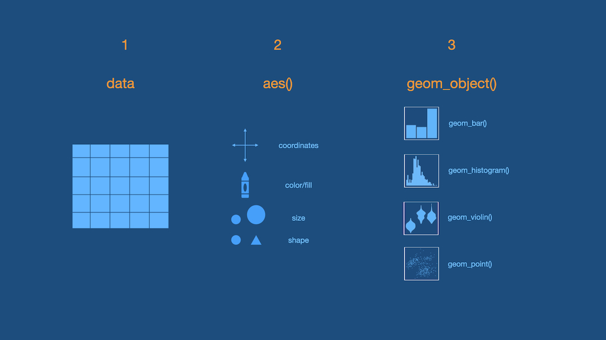

class: title-slide

```{r child = "../setup.Rmd"}
```

```{r echo = FALSE, message=FALSE, warning=FALSE}
xaringanExtra::use_panelset()
library(openintro)
library(tidyverse)
library(gganimate)
library(fGarch)
library(palmerpenguins)
library(tidyverse)
library(titanic)
library(janitor)

babies <- babies %>% 
  mutate(smoke = as.logical(smoke),
         parity = as.logical(parity))
titanic <- titanic_train %>% 
  clean_names() %>% 
  select(survived, pclass, sex, age, fare, embarked) %>% 
  mutate(pclass = case_when(pclass == 1 ~ "First", 
                            pclass == 2 ~ "Second",
                            pclass == 3 ~ "Third"),
         embarked = case_when(embarked == "S" ~ "Southampton",
                              embarked == "C" ~ "Cherbourg",
                              embarked == "Q" ~ "Queenstown"),
         embarked = as.factor(embarked),
         sex = as.factor("sex"),
         survived = as.logical(survived))
```

<br>
<br>
.right-panel[ 

# `r rmarkdown::metadata$title`
## `r rmarkdown::metadata$author`
]

---

class: middle

## Review


---


class: middle

[How LGBTQ+ hate crime is committed by young people against young people](https://www.bbc.com/news/uk-46543874)

[Why Time Flies](https://maximiliankiener.com/digitalprojects/time/)

[Mandatory Paid Vacation](https://www.instagram.com/p/CE1kpM5FhWR/?utm_source=ig_web_copy_link)

[Why are K-pop groups so big?](https://pudding.cool/2020/10/kpop/)

---

class: middle

Data Visualizations

- are graphical representations of data

--

- use different colors, shapes, and the coordinate system to summarize data

--

- tell a story

--

- are useful for exploring data


---

class:inverse middle

.font75[Visuals with a Single Categorical Variable]

---

## Bar plot

.pull-left[

```{r echo=FALSE, fig.align='center', fig.height=5}
ggplot(babies, aes(x = smoke)) +
  geom_bar() +
  ylab("Count") +
  xlab("Smoker Status of Mothers")
```

]

.pull-right[

```{r echo=FALSE, fig.align='center', fig.height=5}
ggplot(babies, aes(x = smoke, y = ..prop.., group = 1)) +
  geom_bar() +
  ylab("Proportion") +
  xlab("Smoker Status of Mothers") 
```
]

---

class:inverse middle

.font75[Visuals with a Single Numeric Variable]

---

## Box plot

.pull-left[

```{r echo=FALSE, fig.align='center', fig.height=5}
ggplot(babies, aes(y = bwt)) +
  geom_boxplot() +
  scale_x_discrete() +
  ylab("Birth Weight") +
  xlab("") 
```


]

.pull-right[

- The horizontal line inside the box represents the median.
- The box itself represents the middle 50% of the data with Q3 on the upper end and Q1 on the lower end. 
- Whiskers extend from the box. They can extend up to 1.5 IQR away from the box (i.e. away from Q1 and Q3). 
- The points are potential outliers that represent babies with really low or high birth weight.

]

---

## Histogram

.pull-left[

Bin width = 5 ounces

```{r echo=FALSE, fig.align='center', fig.height=5, warning=FALSE}
ggplot(babies, aes(x = bwt)) +
  geom_histogram(color = "white", binwidth = 5) +
  ylab("Count") +
  xlab("Birth Weight of Babies") 
```

]

.pull-right[

Bin width = 20 ounces


```{r echo=FALSE, fig.align='center', fig.height=5, warning=FALSE}
ggplot(babies, aes(x = bwt)) +
  geom_histogram(color = "white", binwidth = 20) +
  ylab("Count") +
  xlab("Birth Weight of Babies")
```

]

---

class: middle

[Exploring Histograms Interactively](http://tinlizzie.org/histograms/)

---

class: middle center

[There is no "best" number of bins](https://en.wikipedia.org/wiki/Histogram#Number_of_bins_and_width)

---

class: middle

## Etymology


__histo__ comes from the Greek word _histos_ that literally means "anything set up right".

__gram__: comes from the Greek word _gramma_ which means "that which is drawn".

.footnote[Online Etymology Dictionary]

---

## Histogram vs. Boxplot

.pull-left[

```{r echo = FALSE, message=FALSE, warning=FALSE, fig.height=5, cache = TRUE}
set.seed(12345)
symmetric <- rnorm(n = 10000, mean = 0, sd = 1)
right_skewed <- rsnorm(n = 10000, mean = 0, sd = 1, xi = 20)
left_skewed <- rsnorm(n = 10000, mean = 0, sd = 1, xi = -20)
type <- c(
  rep("left-skewed", 10000),
  rep("symmetric", 10000),
  rep("right-skewed", 10000)
)
x <- c(left_skewed,
       symmetric,
       right_skewed)
data <- tibble(x = x,
                  type = type)
data %>% 
  ggplot(aes(x = x)) +
  geom_histogram() +
  transition_states(type,
                    transition_length = 1,
                    state_length = 10) +
  labs(title = 'Distribution: {closest_state}',
       x = 'observations')
```

Tail tells the tale.

]


.pull-right[
```{r echo = FALSE, fig.height=5, cache = TRUE, message = FALSE}
data %>% 
  ggplot(aes(x = 1, y = x)) +
  geom_boxplot() +
    theme(axis.title.x=element_blank(),
        axis.text.x=element_blank(),
        axis.ticks.x=element_blank()) +
  transition_states(type,
                    transition_length = 1,
                    state_length = 10) +
  labs(title = 'Distribution: {closest_state}',
       y = "observations")
```

]


---


class: middle

.pull-left[
```{r echo = FALSE, message = FALSE, warning = FALSE}
ggplot(penguins,
       aes(x = species,
           y = bill_length_mm))  +
  geom_violin() +
  theme(text = element_text(size=20))

```

]

.pull-right[
```{r echo = FALSE, message = FALSE, warning = FALSE}
ggplot(penguins,
       aes(x = bill_length_mm))  +
  geom_histogram() +
  facet_wrap(~species) +
  coord_flip() +
  theme(text = element_text(size=20))

```
]

.footnote[Note: Violin plots display densities, not counts!]
---

class: middle

.pull-left[
```{r echo = FALSE, message = FALSE, warning = FALSE}
ggplot(penguins,
       aes(x = species,
           y = bill_length_mm))  +
  geom_violin() +
  theme(text = element_text(size=20))

```

]

.pull-right[
```{r echo = FALSE, message = FALSE, warning = FALSE}
ggplot(penguins,
       aes(x = bill_length_mm))  +
  geom_density() +
  facet_wrap(~species) +
  coord_flip() +
  theme(text = element_text(size=20))

```
]

.footnote[Note: Violin plots display densities, not counts!]
---

class: inverse middle center

.font75[Visuals with Two Categorical Variables]

---

class: middle 

## Standardized Bar Plot

```{r echo=FALSE, fig.align='center', fig.height=4}
ggplot(data = babies,
       aes(x = smoke, 
           fill = parity)) + 
  geom_bar(position = "fill") +
  ylab("Proportion") +
  xlab("Mother's Smoker Status")
```

---

class: middle

## Dodged Bar Plot

```{r echo=FALSE, fig.align='center', fig.height=4}
ggplot(data = babies,
       aes(x = smoke, 
           fill = parity)) + 
  geom_bar(position = "dodge")
```


---

class: middle inverse

.font75[Visuals with a single numerical and single categorical variable.]


---

## Side-by-side box plots

```{r echo = FALSE, fig.height=5, fig.align='center'}
ggplot(babies,
       aes(x = smoke,
           y = bwt))  +
  geom_boxplot() +
  labs(x = "Smoker Status of Mother",
       y = "Birth weight (ounces)")
```

---

class: inverse middle

.font75[Visuals with Two Numerical Variables]


---

## Scatter plots

```{r echo = FALSE, fig.height=5, fig.align='center', warning=FALSE}
ggplot(babies,
       aes(x = gestation,
           y = bwt))  +
  geom_point() +
  labs(x = "Gestation (days)",
       y = "Birth weight (ounces)") 
```

Length of gestation can **possibly** eXplain a baby's birth weight. 
Gestation is the eXplanatory variable and is shown on the x-axis.
Birth weight is the response variable and is shown on the y-axis.

---

## Linear Relationship

.pull-left[

```{r eval = FALSE, fig.height=4, fig.align='center', warning=FALSE, message=FALSE}
ggplot(babies,
       aes(x = gestation,
           y = bwt))  +
  geom_point() +
  labs(x = "Gestation (days)",
       y = "Birth weight (ounces)") +
  geom_smooth(method = "lm", se = FALSE)
```
]

.pull-right[

```{r echo = FALSE, fig.height=4, fig.align='center', warning=FALSE, message=FALSE}
ggplot(babies,
       aes(x = gestation,
           y = bwt))  +
  geom_point() +
  labs(x = "Gestation (days)",
       y = "Birth weight (ounces)") +
  geom_smooth(method = "lm", se = FALSE)
```
]


---

class: middle

__gg__plot is based on __g__rammar of __g__raphics.

```{r echo = FALSE}

```

---

## Data

```{r}
glimpse(titanic)
```

.footnote[The data frame has been cleaned for you.]

---

class:inverse middle

.font75[Visualizing a Single Categorical Variable]


---

class: middle

**3 Steps of Making a Basic ggplot**

1.Pick data

2.Map data onto aesthetics


3.Add the geometric layer


---
class: middle

### Step 1 - Pick Data

.pull-left[
```{r eval = FALSE}
ggplot(data = titanic)
```
]

.pull-right[

```{r echo = FALSE, fig.height=5}
ggplot(titanic)
```

]

---

class: middle

### Step 2 - Map Data to Aesthetics

.pull-left[
```{r eval = FALSE}
ggplot(data = titanic,
       aes(x = pclass)) #<<
```
]

.pull-right[

```{r echo = FALSE, fig.height=5}
ggplot(data = titanic,
       aes(x = pclass))
```

]

---

class: middle

### Step 3 - Add the Geometric Layer

.pull-left[
```{r eval = FALSE}
ggplot(data = titanic,
       aes(x = pclass)) +
  geom_bar() #<<
```
]

.pull-right[

```{r echo = FALSE, fig.height=5}
ggplot(data = titanic,
       aes(x = pclass)) +
  geom_bar()
```
]
---

class: middle 

.panelset[

.panel[
.panel-name[Plot]
```{r echo = FALSE, fig.height=5, fig.align='center'}
ggplot(data = titanic,
       aes(x = pclass)) +
  geom_bar()
```

]

.panel[
.panel-name[English]

- Create a ggplot using the `titanic` data frame.
- Map the `pclass` to the x-axis. 
- Add a layer of a bar plot.

]

.panel[
.panel-name[R]
```{r eval = FALSE, fig.height=5}
ggplot(data = titanic,
       aes(x = pclass)) +
  geom_bar()
```

]

]
---

class:inverse middle

.font75[Visualizing a Single Numeric Variable]

---

class: middle

.panelset[

.panel[
.panel-name[Plot]
```{r echo = FALSE, fig.height=5, fig.align='center'}
ggplot(data = titanic,
       aes(x = fare)) +
  geom_histogram() 
```

]

.panel[
.panel-name[English]

- Create a ggplot using the `titanic` data frame.
- Map the `fare` to the x-axis. 
- Add a layer of a histogram.

]

.panel[
.panel-name[R]
```{r eval = FALSE, fig.height=5}
ggplot(data = titanic,
       aes(x = fare)) +
  geom_histogram() 
```

]

]

---
class: middle

### Step 1 - Pick Data

.pull-left[
```{r eval = FALSE}
ggplot(data = titanic)
```
]

.pull-right[

```{r echo = FALSE, fig.height=5}
ggplot(titanic)
```

]

---

class: middle

### Step 2 - Map Data to Aesthetics

.pull-left[
```{r eval = FALSE}
ggplot(data = titanic,
       aes(x = fare)) #<<
```
]

.pull-right[

```{r echo = FALSE, fig.height=5}
ggplot(data = titanic,
       aes(x = fare))
```

]

---

class: middle

### Step 3 - Add the Geometric Layer

.pull-left[
```{r eval = FALSE}
ggplot(data = titanic,
       aes(x = fare)) +
  geom_histogram() #<<
```
]

.pull-right[

```{r echo = FALSE, fig.height=5}
ggplot(data = titanic,
       aes(x = fare)) +
  geom_histogram()
```
]

---

## What is this warning?

```{r echo = FALSE, fig.height=5, fig.align='center'}
ggplot(data = titanic,
       aes(x = fare)) +
  geom_histogram()
```

---


```{r fig.height=5, fig.align='center'}
ggplot(data = titanic,
       aes(x = fare)) +
  geom_histogram(binwidth = 15) #<<
```


---

class: middle


.panelset[
.panel[.panel-name[binwidth = 15]

.left-panel[


]

```{r echo = FALSE, fig.height=5, fig.align='center'}
ggplot(data = titanic,
       aes(x = fare)) +
  geom_histogram(binwidth = 15)
```

]

.panel[.panel-name[binwidth = 50]

```{r echo = FALSE, fig.height=5, fig.align='center'}
ggplot(data = titanic,
       aes(x = fare)) +
  geom_histogram(binwidth = 50)
```

]

.panel[.panel-name[binwidth = 100]

```{r echo = FALSE, fig.height=5, fig.align='center'}
ggplot(data = titanic,
       aes(x = fare)) +
  geom_histogram(binwidth = 100)
```

]


]

---

class: middle center

[There is no "best" number of bins](https://en.wikipedia.org/wiki/Histogram#Number_of_bins_and_width)


---

class: middle center


.font150[
`r emojifont::emoji(emojifont::search_emoji('rainbow'))[1]`
] 

Pick your favorite color(s) from the list at:

[bit.ly/colors-r](https://bit.ly/colors-r)

---

```{r fig.align='center', fig.height=5}
ggplot(data = titanic,
       aes(x = fare)) +
  geom_histogram(binwidth = 15, 
                 color = "white") #<<
```

---

```{r fig.align='center', fig.height=5}
ggplot(data = titanic,
       aes(x = fare)) +
  geom_histogram(binwidth = 15, 
                 fill = "darkred") #<<
```

---

```{r fig.align='center', fig.height=5}
ggplot(data = titanic,
       aes(x = fare)) +
  geom_histogram(binwidth = 15, 
                 color = "white", #<<
                 fill = "darkred") #<<
```

---

class: inverse middle center

.font75[Visualizing Two Categorical Variables]

---

## Stacked Bar-Plot

.pull-left[

```{r eval = FALSE}
ggplot(data = titanic,
       aes(x = pclass, 
           fill = survived)) + #<<
  geom_bar() 
```
]

.pull-right[

```{r echo = FALSE, fig.height=5}
ggplot(data = titanic,
       aes(x = pclass, 
           fill = survived)) +
  geom_bar()
```
]

---

## Standardized Bar Plot

.pull-left[

```{r eval = FALSE}
ggplot(data = titanic,
       aes(x = pclass, 
           fill = survived)) + 
  geom_bar(position = "fill") #<<
```
]

.pull-right[

```{r echo = FALSE, fig.height=5}
ggplot(data = titanic,
       aes(x = pclass, fill = survived)) +
  geom_bar(position = "fill")
```
]

.footnote[Note that y-axis is no longer count but we will learn how to change that later.]

---

## Dodged Bar Plot

.pull-left[

```{r eval = FALSE}
ggplot(data = titanic,
       aes(x = pclass, 
           fill = survived)) + 
  geom_bar(position = "dodge") #<<
```
]

.pull-right[

```{r echo = FALSE, fig.height=5}
ggplot(data = titanic,
       aes(x = pclass, fill = survived)) +
  geom_bar(position = "dodge")
```
]

.footnote[Note that y-axis is no longer count but we will change that later.]


---

## New Data

```{r echo = FALSE, fig.align='center', fig.height=0.3}

```

.footnote[Artwork by [@allison_horst](https://twitter.com/allison_horst) ]

---

## New Data

```{r}
glimpse(penguins)
```

---

```{r echo = FALSE, fig.align='center'}

```

.footnote[Artwork by [@allison_horst](https://twitter.com/allison_horst) ]


---

class: middle inverse

.font75[Visualizing a single numerical and single categorical variable.]

---

class: middle 

.panelset[

.panel[
.panel-name[Plot]
```{r echo = FALSE, fig.height=5, fig.align='center'}
ggplot(penguins,
       aes(x = species,
           y = bill_length_mm))  +
  geom_violin()
```

]

.panel[
.panel-name[English]

- Create a ggplot using the `penguins` data frame.
- Map the `species` to the x-axis and `bill_length_mm` to the y-axis. 
- Add a layer of a violin plot.

]

.panel[
.panel-name[R]
```{r eval = FALSE, fig.height=5}
ggplot(penguins,
       aes(x = species,
           y = bill_length_mm))  +
  geom_violin()
```

]

]

---


class: middle 

.panelset[

.panel[
.panel-name[Plot]
```{r echo = FALSE, fig.height=5, fig.align='center'}
ggplot(penguins,
       aes(x = species,
           y = bill_length_mm))  +
  geom_boxplot()
```

]

.panel[
.panel-name[English]

- Create a ggplot using the `penguins` data frame.
- Map the `species` to the x-axis and `bill_length_mm` to the y-axis. 
- Add a layer of a box plot.

]

.panel[
.panel-name[R]
```{r eval = FALSE, fig.height=5}
ggplot(penguins,
       aes(x = species,
           y = bill_length_mm))  +
  geom_boxplot()
```

]

]


---
class: inverse middle

.font75[Visualizing Two Numerical Variables]

---

.left-panel[
```{r eval = FALSE}
ggplot(penguins,
       aes(x = bill_depth_mm,
           y = bill_length_mm))  +
  geom_point()
```

]

.right-panel[
```{r echo = FALSE}
ggplot(penguins,
       aes(x = bill_depth_mm,
           y = bill_length_mm))  +
  geom_point()
```

]

---

```{r echo = FALSE, out.width ="95%"}

```


---

class: middle

## Practice

Using either the `babies`, `titanic` or `penguins` data frame ask a question that you are interested in answering. Visualize data to get a visual answer to the question. What is the visual telling you? Note all of this down in your lecture notes.

