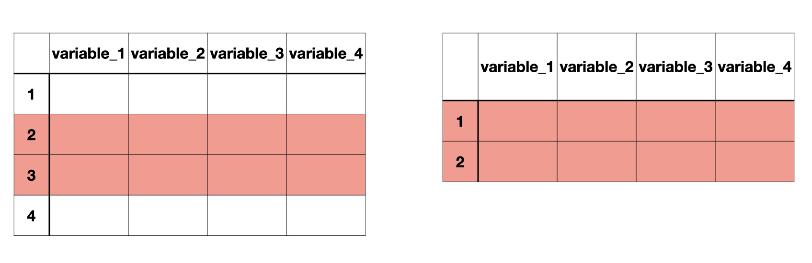

class: title-slide

```{r child = "../setup.Rmd"}
```

```{r echo = FALSE, message = FALSE}
library(tidyverse)
library(janitor)
options(scipen = 999)
```

<br>
<br>
.right-panel[ 

# `r rmarkdown::metadata$title`
## `r rmarkdown::metadata$author`
]

---

class: middle

## Review


---

class: middle

## Goals


- Subsetting data frames
- Changing variables


---


class: middle inverse

.font50[Subsetting data frames]

---


```{r echo = FALSE, message = FALSE}
lapd <- read_csv(here::here("slides/data/Police_Payroll.csv")) 
```


```{r}
glimpse(lapd)
```

---

```{r}

lapd <- clean_names(lapd)
glimpse(lapd)
```


---

class: middle 

## subsetting variables/columns

```{r echo = FALSE, out.width="80%"}
knitr::include_graphics("img/data-wrangle.001.jpeg")
```

--

`select()`

---

class: middle 

## subsetting observations/rows

```{r echo = FALSE, out.width="80%"}

```

`slice()` and `filter()` 

---

`select` is used to select certain variables in the data frame. 


.left-panel[
```{r}
select(lapd, year, base_pay)
```
]

--

.right-panel[

```{r}
lapd %>% 
  select(year, base_pay)
```

]

---

`select` can also be used to drop certain variables if used with a negative sign.

```{r}
select(lapd, -row_id, -department_title)
```

---

class: middle 

## Selection helpers

`starts_with()`  
`ends_with()`  
`contains()`  

---

```{r}
select(lapd, starts_with("q"))
```

---

```{r}
select(lapd, ends_with("pay"))
```

---

```{r}
select(lapd, contains("pay"))
```

---

class: middle 

## subsetting variables/columns

```{r echo = FALSE, out.width="80%"}
knitr::include_graphics("img/data-wrangle.001.jpeg")
```

--

`select()`

---

## subsetting observations/rows

```{r echo = FALSE, out.width="80%"}

```

`slice()` and `filter()` 

---

.pull-left[
`slice()` subsetting rows based on a row number.

The data below include all the rows from third to seventh. Including third and seventh.

```{r}
slice(lapd, 3:7)
```


]

--

.pull-right[

`filter()` subsetting rows based on a condition.

The data below includes rows when the recorded year is 2018.

```{r}
filter(lapd, year == 2018)
```

]

---

class: middle 

.pull-left[

### Relational Operators in R


| Operator | Description              |
|----------|--------------------------|
| <        | Less than                |
| >        | Greater than             |
| <=       | Less than or equal to    |
| >=       | Greater than or equal to |
| ==       | Equal to                 |
| !=       | Not equal to             |

]

.pull-right[

### Logical Operators in R

| Operator | Description |
|----------|-------------|
| &        | and         |
| &#124;   | or          |

### Miscellaneous Operators

| Operator | Description |
|----------|-------------|
| :        | creates a series of numbers         |
|%in%	   | checks if an element is in a vector          |
|%*%	   | matrix multiplication         |

]

---

class: middle

Q. According to [datausa.io](https://datausa.io/profile/geo/los-angeles-ca#:~:text=In%202018%2C%20Los%20Angeles%2C%20CA,%2462%2C474%2C%20a%203.78%25%20increase.) Los Angeles had a median household income of $62474 in 2018. How many LAPD staff members had a base pay higher than $62474 in year 2018 according to this data?

.footnote[Median household income is **not** the same thing as median employee income. Our aim is data wrangling and not necessarily statistical analysis for now.]

---

```{r}
lapd %>% 
  filter(year == 2018 & base_pay > 62474)
```


---

class: middle 


```{r}
lapd %>% 
  filter(year == 2018 & base_pay > 62474) %>% 
  nrow()
```

---

class: middle 

Q. How many observations are available between 2013 and 2015 including 2013 and 2015?

--

```{r}
lapd %>% 
  filter(year >= 2013 & year <= 2015)
```

---

class: middle 

Q. How many observations are available between 2013 and 2015 including 2013 and 2015?


```{r}
lapd %>% 
  filter(year >= 2013 & year <= 2015) %>% 
  nrow()
```

---

class: middle 

Q. How many LAPD staff were employed full time in 2018?


```{r}
lapd %>% 
  filter(employment_type == "Full Time" & year == 2018) %>% 
  nrow()
```

---
class: middle

We have done all sorts of selections, slicing, filtering on `lapd` but it has not changed at all. Why do you think so?

```{r}
glimpse(lapd)
```

---

class: middle

Moving forward we are only going to focus on year 2018, and use `job_class_title`, `employment_type`, and `base_pay`. Let's clean our data accordingly and move on with the smaller `lapd` data that we need.

---

class: middle

```{r}
lapd %>% 
  filter(year == 2018) %>% 
  select(job_class_title, 
         employment_type, 
         base_pay)
```

---

class: middle

```{r}
lapd <- 
  lapd %>% 
  filter(year == 2018) %>% 
  select(job_class_title, 
         employment_type, 
         base_pay)
```


---

class: middle

```{r echo = FALSE, message = FALSE}
lapd <- read_csv(here::here("slides/data/Police_Payroll.csv")) %>% 
  janitor::clean_names() %>% 
  filter(year == 2018) %>% 
  select(job_class_title, 
         employment_type, 
         base_pay)
```


```{r}
glimpse(lapd)
```

**Goal**: 

Create a new variable called `base_pay_k` that represents `base_pay` in thousand dollars.

---

class: middle

```{r}
lapd %>% 
  mutate(base_pay_k = base_pay/1000)
```

---

class: middle

```{r}
glimpse(lapd)
```

**Goal**: 

Create a new variable called `base_pay_level` which has `Less Than 0`, `No Income`, `Less than Median and Greater than 0` and `Greater than Median`. We will consider $62474 as the median (from previous lecture).

---

class: middle

Let's first check to see there is anyone earning exactly the median value.

```{r}
lapd %>% 
  filter(base_pay == 62474)
```

---

```{r}
lapd %>% 
  mutate(base_pay_level = case_when(
    base_pay < 0 ~ "Less than 0", 
    base_pay == 0 ~ "No Income",
    base_pay < 62474 & base_pay > 0 ~ "Less than Median, Greater than 0",
    base_pay > 62474 ~ "Greater than Median")) 
```

---

We can't really see what we have created 

```{r}
lapd %>% 
  mutate(base_pay_level = case_when(
    base_pay < 0 ~ "Less than 0", 
    base_pay == 0 ~ "No Income",
    base_pay < 62474 & base_pay > 0 ~ "Less than Median, Greater than 0",
    base_pay > 62474 ~ "Greater than Median")) %>% 
  select(base_pay_level)
```


---

We can use pipes with ggplot too! 

.left-panel[
```{r eval = FALSE}
lapd %>% 
  mutate(base_pay_level = case_when(
    base_pay < 0 ~ "Less than 0", 
    base_pay == 0 ~ "No Income",
    base_pay < 62474 & base_pay > 0 ~ "Less than Median, Greater than 0",
    base_pay > 62474 ~ "Greater than Median")) %>% 
  select(base_pay_level) %>% 
  ggplot(aes(x = base_pay_level)) +
  geom_bar()
```
]

.right-panel[
```{r echo = FALSE}
lapd %>% 
  mutate(base_pay_level = case_when(
    base_pay < 0 ~ "Less than 0", 
    base_pay == 0 ~ "No Income",
    base_pay < 62474 & base_pay > 0 ~ "Less than Median, Greater than 0",
    base_pay > 62474 ~ "Greater than Median")) %>% 
  select(base_pay_level) %>% 
  ggplot(aes(x = base_pay_level)) +
  geom_bar()
```
]

---

class: middle

```{r}
glimpse(lapd)
```

**Goal**: 

Make `job_class_title` and `employment_type` factor variables. 


---

class: middle

```{r}
lapd %>% 
  mutate(employment_type = as.factor(employment_type),
         job_class_title = as.factor(job_class_title)) 
```

---

class: middle

`as.factor()` - makes a vector factor  
`as.numeric()` - makes a vector numeric  
`as.integer()` - makes a vector integer  
`as.double()` - makes a vector double  
`as.character()` - makes a vector character  

---

class: middle

Once again we did not "save"
anything into `lapd`. As we work on data cleaning it makes sense not to "save" the data frames. Once we see the final data frame we want then we can "save" (i.e. overwrite) it.

---

In your lecture notes, you can do all the changes in this lecture in one long set of piped code. That's the beauty of piping!

```{r eval = FALSE}
lapd <- 
  lapd %>% 
  clean_names() %>% 
  filter(year == 2018) %>% 
  select(job_class_title, 
         employment_type, 
         base_pay) %>% 
    mutate(employment_type = as.factor(employment_type),
           job_class_title = as.factor(job_class_title),
           base_pay_level = case_when(
             base_pay < 0 ~ "Less than 0", 
             base_pay == 0 ~ "No Income",
             base_pay < 62474 & base_pay > 0 ~ "Less than Median, Greater than 0",
             base_pay > 62474 ~ "Greater than Median")) 
```

---

class: middle

## Word of caution

The functions `clean_names()`, `select()`, `filter()`, `mutate()` all take a data frame as the first argument. Even though we do not see it, the data frame is piped through from the previous step of code at each step. 
When we use these functions without the `%>%` we have to include the data frame explicitly.


.pull-left[
Data frame is used as the first argument
```{r}
clean_names(lapd)
```
]

.pull-right[
Data frame is piped

```{r}
lapd %>% 
  clean_names()
```
]