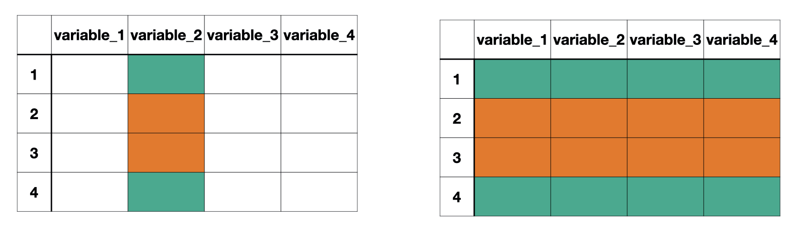

class: title-slide

```{r child = "../setup.Rmd"}
```

```{r echo = FALSE, message = FALSE}
library(tidyverse)
library(janitor)
options(scipen = 999)
```

<br>
<br>
.right-panel[ 

# `r rmarkdown::metadata$title`
## `r rmarkdown::metadata$author`
]

---

class: middle

## Review

Quiz  


---

class: middle

## Goals 

- Review aggregating data
- Aggregating group data
- Data joins
- Lots of data wrangling practice

---
class: middle

```{r echo = FALSE, message = FALSE}
lapd <- 
  read_csv(here::here("slides/data/Police_Payroll.csv")) %>% 
  janitor::clean_names() %>% 
  filter(year == 2018) %>% 
  select(job_class_title, 
         employment_type, 
         base_pay) %>% mutate(employment_type = as.factor(employment_type),
           job_class_title = as.factor(job_class_title),
           base_pay_level = case_when(
             base_pay < 0 ~ "Less than 0", 
             base_pay == 0 ~ "No Income",
             base_pay < 62474 & base_pay > 0 ~ "Less than Median, Greater than 0",
             base_pay > 62474 ~ "Greater than Median")) 

xaringanExtra::use_panelset()

artists <- readxl::read_xlsx("../data/spotify.xlsx", sheet = "artist")
songs <- readxl::read_xlsx("../data/spotify.xlsx", sheet = "top_song")
albums <- readxl::read_xlsx("../data/spotify.xlsx", sheet = "album") %>% 
  mutate(album_release_date = lubridate::ymd(album_release_date))
```


.pull-left[
## Data
Observations
]

.pull-left[
## Aggregate Data
Summaries of observations
]

---
class: inverse middle

.font75[Aggregating Categorical Data]

---

class: middle

Categorical data are summarized with **counts** or **proportions**

---

class: middle

```{r}
lapd %>% 
  count(employment_type)
```


---

class: middle

```{r}
lapd %>% 
  count(employment_type) %>% 
  mutate(prop = n/sum(n))
```


---

class: middle

## Mean


```{r}
summarize(lapd, 
          mean_base_pay = mean(base_pay))
```


---

class: middle

Recall that we use multiple functions such as `mean()` and `median` within the summarize function

```{r}
summarize(lapd,
          mean_base_pay = mean(base_pay),
          med_base_pay = median(base_pay))
```

---

class: inverse middle

.font75[Aggregating Data by Groups]

---

class: middle

`group_by()`

```{r echo = FALSE, out.width="80%", fig.align='center'}

```

`group_by()` separates the data frame by the groups. Any action following `group_by()` will be completed for each group separately.
---

class: middle

Q. What is the median salary for each employment type?

---

```{r}
lapd %>% 
  group_by(employment_type)
```

---

```{r}
lapd %>% 
  group_by(employment_type) %>% 
  summarize(med_base_pay = median(base_pay))
```

---

class: middle

We can also remind ourselves how many staff members there were in each group.

```{r}
lapd %>% 
  group_by(employment_type) %>% 
  summarize(med_base_pay = median(base_pay),
            count = n())
```

Note that `n()` does not take any arguments.

---
class: middle

```{r echo = FALSE}

```

.font15[Image from [R for Data Science book](https://r4ds.had.co.nz/index.html) licensed under the [Creative Commons Attribution-NonCommercial-NoDerivs 3.0 License](https://creativecommons.org/licenses/by-nc-nd/3.0/us/)] 

---

class: middle

## Inner Join

```{r echo = FALSE}

```

.font15[Image from [R for Data Science book](https://r4ds.had.co.nz/index.html) licensed under the [Creative Commons Attribution-NonCommercial-NoDerivs 3.0 License](https://creativecommons.org/licenses/by-nc-nd/3.0/us/)] 

---


class: middle

#### Outer Joins

```{r echo = FALSE, out.width="40%"}

```

.font15[Image from [R for Data Science book](https://r4ds.had.co.nz/index.html) licensed under the [Creative Commons Attribution-NonCommercial-NoDerivs 3.0 License](https://creativecommons.org/licenses/by-nc-nd/3.0/us/)] 

---

class: middle

## Data Joins

```{r echo = FALSE, out.width="80%"}

```

.font15[Image from [R for Data Science book](https://r4ds.had.co.nz/index.html) licensed under the [Creative Commons Attribution-NonCommercial-NoDerivs 3.0 License](https://creativecommons.org/licenses/by-nc-nd/3.0/us/)] 

---

.panelset[
.panel[
.panel-name[artists]

```{r}
artists
```


]

.panel[
.panel-name[songs]

```{r}
songs
```


]

.panel[
.panel-name[albums]

```{r}
albums
```

]
]

---

class: middle

```{r echo = FALSE, out.width="90%"}

```

---

class: middle

## Join Functions

`something_join(x, y)` All the join functions in dplyr package are in this fashion where x represents the first data frame and y represents the second data frame.


---

.panelset[
.panel[

.panel-name[x]

```{r}
songs
```


]

.panel[

.panel-name[y]

```{r}
albums
```


]

.panel[

.panel-name[left_join()]

```{r}
left_join(songs, albums, by = "album_name")
```

]

]

`left_join()` includes all rows from x


---

.panelset[
.panel[

.panel-name[x]

```{r}
songs
```


]

.panel[

.panel-name[y]

```{r}
albums
```


]

.panel[

.panel-name[right_join()]

```{r}
right_join(songs, albums, by = "album_name")
```

]

]

`right_join()` includes all rows from `y`

---

.panelset[
.panel[

.panel-name[x]

```{r}
songs
```


]

.panel[

.panel-name[y]

```{r}
albums
```


]

.panel[

.panel-name[inner_join()]

```{r}
inner_join(songs, albums, by = "album_name")
```

]

]

`inner_join()` includes all rows that are in x **and** y

---

.panelset[
.panel[

.panel-name[x]

```{r}
songs
```


]

.panel[

.panel-name[y]

```{r}
albums
```


]

.panel[

.panel-name[full_join()]

```{r}
full_join(songs, albums, by = "album_name")
```

]

]

`full_join()` includes all rows that are in x **or** y

---


.panelset[
.panel[
.panel-name[artists]

```{r}
artists
```


]

.panel[
.panel-name[songs]

```{r}
songs
```


]

.panel[
.panel-name[albums]

```{r}
albums
```

]

.panel[
.panel-name[combined]

```{r}
full_join(artists, songs, by = "name") %>% 
  full_join(albums, by = "album_name")
  
```


]


]

---
class: middle

Complete the questions provided to you in the lecture notes.

