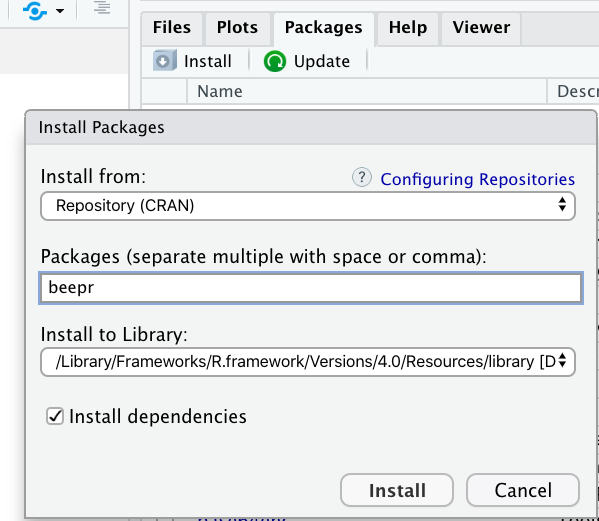

class: title-slide

```{r child = "../setup.Rmd"}
```

```{r echo = FALSE, message = FALSE}
library(tidyverse)
options(scipen = 999)
```

<br>
<br>
.right-panel[ 

# `r rmarkdown::metadata$title`
## `r rmarkdown::metadata$author`
]

---

class: middle

## Review


---

class: middle

## Goals

- R packages
- Dates
- Strings

---


class: middle center

.pull-left[

__Default__

```{r echo=FALSE, out.width='60%'}
knitr::include_graphics('img/office-suite-default.png')
```

]

.footnote[Microsoft products have Copyright. Images used based on [fair use](https://www.microsoft.com/en-us/legal/copyright/default.aspx) for educational purposes.]

.pull-right[

__Optional__

```{r echo=FALSE, out.width='60%'}
knitr::include_graphics('img/office-suite-optional.png')
```


]

---
class: middle

## R packages


When you download R, you actually download base R. 

--

But there are MANY optional packages you can download.


---

class: middle


## R packages

There are more than 15000 R packages. 

--

Good part: There is an R package for (almost) everything, from complex statistical modeling packages to baby names.

--

Bad part: At the beginning it can feel overwhelming. 

---

class: middle 

## R packages

All this time we have actually been using R packages. 

---

class: middle 

## R packages

What do R packages have? All sorts of things but mainly

- functions 

- datasets

---

class: middle

## R packages

Try running the following code:

```{r error = TRUE}
beep()
```

Why are we seeing this error? 

---

class:inverse middle

.font75[Installing packages]

---

## Using `install.packages()`

In your **Console**, install the beepr package

```{r eval = FALSE}
install.packages("beepr")
```

We do this in the Console because we only need to do it once.

---

## Using Packages pane

```{r echo = FALSE, out.width="40%", fig.align='center'}

```

Packages Pane > Install 

---

## Letting RStudio Install

```{r echo = FALSE, out.width="80%", fig.align='center'}
knitr::include_graphics("img/rstudio-install.png")
```

If you save your file and using a package RStudio will tell you that you have not installed the package.

---

class:inverse middle

.font75[Using packages]

---

## Using beep() from beepr

.pull-left[
Option 1
```{r warning = FALSE, eval = FALSE}
library(beepr)
beep()
```

More common usage. 
Useful if you are going to use multiple functions from the same package.
E.g. we have used many functions (ggplot, aes, geom_...) from the ggplot2 package. In such cases, usual practice is to put the library name in the first R chunk in the .Rmd file.

]

.pull-right[
Option 2
```{r eval = FALSE}
beepr::beep()
```
Useful when you are going to use a function once or few times. Also useful if there are any conflicts. For instance if there is some other package in your environment that has a beep() function that prints the word beep, you would want to distinguish the beep function from the beepr package and the beep function from the other imaginary package. 
]

---

```{r echo=FALSE, fig.align='center', out.width="80%"}

```


---

class: middle

## Open Source

Any one around the world can create R packages. 

--

Good part: We are able to do pretty much anything R because someone from around the world has developed the package and shared it. 

--

Bad part: The language can be inconsistent. 

--

Good news: We have tidyverse. 


---

## Tidyverse


>The tidyverse is an opinionated collection of R packages designed for data science. All packages share an underlying design philosophy, grammar, and data structures. 
                  tidyverse.org
---

## Tidyverse

In short, tidyverse is a family of packages. From practical stand point, you can install many tidyverse packages at once (and you did this). By doing that you installed all the following packages.

- ggplot2
- dplyr
- tidyr
- readr
- purrr
- tibble
- stringr
- forcats

---

class: middle 

We can also load the tidyverse packages all at the same time.

```{r message = TRUE}
library(tidyverse)
```

---

## Fun fact

.left-panel[
```{r message = FALSE}
library(magrittr)
```

```{r echo=FALSE, out.width='40%', fig.align='center'}
knitr::include_graphics('img/pipe-logo.png')
```
]

.right-panel[
[Treachery of Images](https://en.wikipedia.org/wiki/The_Treachery_of_Images#/media/File:MagrittePipe.jpg) by René Magritte

```{r echo=FALSE, out.width='70%', fig.align='center'}
knitr::include_graphics('img/magritte.jpg')
```

.footnote[Image for Treachery of Images is from University of Alabama [website](https://tcf.ua.edu/Classes/Jbutler/T311/Modernism.htm) and used under fair use for educational purposes.]
]

---


```{r echo = FALSE, fig.align='center', out.width="40%"}


```


```{r message = FALSE}
library(lubridate)
```

---

class: middle

```{r echo = FALSE, fig.align='center', out.height="95%"}
knitr::include_graphics("https://imgs.xkcd.com/comics/iso_8601.png")
```

.footnote[https://xkcd.com/1179/]


---

class: middle

```{r}
today()
now()
```

---
class: inverse middle

.font75[From strings to dates]

---

#### `mdy()`

```{r}

arrival <- c("November 1st, 2005", "February 2nd 2007")

```

--

```{r}
str(arrival)
```

--

```{r}
mdy(arrival)
```

--

```{r}
str(mdy(arrival))
```

---

class: middle

```{r}
mdy("11012005")
```

--

```{r}
mdy("Nov-01-2005")
```

---

class: middle

`mdy()`

--

`ymd()`

--

`dmy()`


---

class: middle 

We can include hours, minutes and seconds too.

```{r}
mdy_hms("11/01/2005 22:05:18")
```

--


```{r}
mdy_hms("11/01/2005 22:05:18") %>% 
  str()
```


---

class: middle

## Types

`date`

--

`time`

--

`date-time`

--

`POSIXct`

--

`POSIXlt`

These represent date-time vectors in R.

---

class: middle

## Including time zones

```{r}
mdy_hms("11/01/2005 22:05:18", 
        tz = "America/Los_Angeles")
```

---

## All time zones

```{r}
OlsonNames()
```

---

### All time zones

```{r}
length(OlsonNames())
```

--

```{r}
OlsonNames()[114:119]
```

---

class: inverse middle

.font75[Time spans]

---

```{r}
today() - ymd("1911/05/31")
```

--

```{r}
since_titanic <- today() - ymd("1911/05/31")
str(since_titanic)
```

---

## Durations

```{r}
since_titanic <- as.duration(since_titanic)
str(since_titanic)
since_titanic
```


---

class: middle

## Durations

```{r}
some_date <- ymd("1911/05/31")

some_date + ddays(3)
```

--

```{r}

some_date + ddays(3) + dseconds(4)
```

---

```{r}
some_time <- mdy_hms("10/31/2020 10:05:18", 
        tz = "America/Los_Angeles")

some_time
```

--

```{r}
some_time + ddays(1)
```

--

Lubridate package takes daylight savings into account.

---

class: inverse middle

.font50[Components of Data and Time]

---

## Getting Year

```{r}
apollo11_return <- ymd_hm("1969/07/21 17:54")
apollo11_return
```

--

```{r}
year(apollo11_return)
```

---

## Getting Month

```{r}
month(apollo11_return)
```

--

```{r}
month(apollo11_return, label = TRUE)
```

---

### Getting Day and Day of the Week

```{r}
day(apollo11_return)
```

--

```{r}
wday(apollo11_return)
```

--

```{r}
wday(apollo11_return, label = TRUE)
```

---

class: center middle

[lubridate cheatsheet](https://github.com/rstudio/cheatsheets/raw/master/lubridate.pdf)

---

```{r echo = FALSE, fig.align='center', out.width="40%"}

knitr::include_graphics("img/stringr-logo.png")
```

---


class: middle center

[Friends](https://www.imdb.com/title/tt0108778)

---

```{r echo = FALSE, message=FALSE}
library(tidyverse)
friends <- read_csv(here::here("slides/data/friends.csv"))
```
 
```{r}
glimpse(friends)
```

---

```{r}
friends$description
```

---

```{r}
friends$description[1]
```

--

```{r}
first_episode_desc <- friends$description[1]
```


---


class: middle 

```{r eval=FALSE}
str_something(some_character_vector, ....)
```


---

class: inverse middle

.font75[str_length()]

---

```{r}
str_length(first_episode_desc)
```

`str_length()` returns the length of string.

---

Which episode has the longest description?

```{r}
str_length(friends$description)
```

---

Which episode has the longest description?

```{r}
max(str_length(friends$description))
```
---

Which episode has the longest description?

```{r}
friends %>% 
  filter(str_length(description) == max(str_length(description)))
```


---

Which episode has the longest description?

```{r}
friends %>% 
  filter(str_length(description) == max(str_length(description))) %>% 
  select(description) %>% 
  pull() %>% 
  str_length()
```

---

class: inverse middle

.font75[str_sub()]

---

```{r}
first_episode_desc
```

--

```{r}
# 2nd to 8th character
str_sub(first_episode_desc, 2, 8)
```

--

```{r}
# 4th to fifth-to-last character 
str_sub(first_episode_desc, 4, -5)
```

---

class: middle inverse

.font75[str_to_lower()]  
.font75[str_to_upper()]

---

```{r}
str_to_lower(first_episode_desc)
```

--

```{r}
str_to_upper(first_episode_desc)
```


---

Change all the titles to capital letters.

```{r}
friends %>% 
  mutate(title = str_to_upper(title))
```

---
class: middle inverse

.font75[str_detect()]  


---

```{r}
str_detect(first_episode_desc, "Rachel")
```

--

```{r}
str_detect(first_episode_desc, "Ross")
```


---

How many episodes have "Phoebe" in the description?

```{r}
str_detect(friends$description, "Phoebe") 
```

---

```{r}
str_detect(friends$description, "Phoebe") %>% 
  sum()
```

---

class: inverse middle

.font75[str_split()]

---

```{r}
str_split(first_episode_desc, boundary("word"))
```

---

```{r}
str_split(first_episode_desc, boundary("character"))
```

---

class: inverse middle

.font75[str_replace()]

---

class: middle

```{r}
str_replace(first_episode_desc, "Monica", "Monika")
```


---

class: center middle

[stringr cheatsheet](https://github.com/rstudio/cheatsheets/raw/master/strings.pdf)

---


```{r echo = FALSE, fig.align='center', out.width="30%"}
knitr::include_graphics("img/forcats-logo.png")
```


Functions have the form `fct_something()`

--

Most of the examples in this lecture is from the `forcats` packages documentation.

---

```{r}
glimpse(gss_cat)
```


---

class:: inverse middle

.font75[Collapsing factors]

---

```{r}
str(gss_cat$partyid)
```

---

```{r}
count(gss_cat, partyid)
```

---

```{r}
partyid2 <- fct_collapse(gss_cat$partyid,
                         missing = c("No answer", "Don't know"),
                         other = "Other party",
                         rep = c("Strong republican", "Not str republican"),
                         ind = c("Ind,near rep", "Independent", "Ind,near dem"),
                         dem = c("Not str democrat", "Strong democrat")
)
```


---

```{r}
partyid2
```

---

```{r}
gss_cat %>% 
  mutate(partyid2 = fct_collapse(partyid,
                                 missing = c("No answer", "Don't know"),
                                 other = "Other party",
                                 rep = c("Strong republican", "Not str republican"),
                                 ind = c("Ind,near rep", "Independent", "Ind,near dem"),
                                 dem = c("Not str democrat", "Strong democrat"))
)
```


---

class: middle inverse

.font75[Dropping levels]

---

```{r}
year <- factor(c("sophomore", "sophomore", "first-year", "sophomore"), 
            levels = c("first-year", "sophomore", "junior", "senior"))
year

```

--

```{r}
fct_drop(year)
```

--

```{r}
fct_drop(year, only = "senior")
```

---

class: middle inverse

.font75[Matching]

---

```{r}
fct_match(gss_cat$marital, "Married")
```

---

```{r}
fct_match(gss_cat$marital, c("Married", "Divorced"))
```

---

We can use these functions along with other data wrangling functions.

```{r}
gss_cat %>% 
  mutate(married_divorced = fct_match(marital, c("Married", "Divorced")))
```


---

class: inverse middle

.font75[Recoding levels]

---

```{r}
places <- factor(c("Irvine", 
                   "Los Angeles", 
                   "Albany", 
                   "New York City"))
places

```

---

```{r}
fct_recode(places, 
           California = "Irvine", 
           California = "Los Angeles") 
```


---

```{r}
fct_recode(places, 
           California = "Irvine", 
           California = "Los Angeles")
```

---

```{r warning = TRUE, error=TRUE}
fct_recode(places, 
           California = "Irvinnne", 
           California = "Los Angeles")
```

---

class: center middle

[forcats cheatsheet](https://github.com/rstudio/cheatsheets/raw/master/factors.pdf)
