class: title-slide

```{r child = "../setup.Rmd"}
```

```{r echo = FALSE, message = FALSE}
library(tidyverse)
options(scipen = 999)
```

<br>
<br>
.right-panel[ 

# `r rmarkdown::metadata$title`
## `r rmarkdown::metadata$author`
]

---

class: middle

## Review

Quiz  

---

class: middle

## Goals

- Naming files
- README.md
- gitignore
- Importing data
- Collaborating on GitHub

---

class: center middle inverse

.font50[Naming files]

---

class: middle

Three principles of naming files 

- machine readable
- human readable
- plays well with default ordering (e.g. alphabetical and numerical ordering)

(Jenny Bryan)

for the purposes of this class an additional principle is that file names follow

- tidyverse style (all lower case letters, words separated by HYPHEN)

---

class: center middle inverse

.font50[README.md]

---

class: middle

- README file is the first file users read. In our case a user might be our future self, a teammate, or (if open source) anyone.

--

- There can be multiple README files within a single directory: e.g. for the general project folder and then for a data subfolder. Data folder README's can possibly contain codebook (data dictionary).

--

- It should be brief but detailed enough to help user navigate. 

--

- a README should be up-to-date (e.g. from proposal to presentation stage of final projects they need to be updated).

--

- On GitHub we use markdown for README file (`README.md`). Good news: [emojis are supported.](https://gist.github.com/rxaviers/7360908)

---

class: middle

## README examples

- [Stats 295 website](https://github.com/stats295r-fa21/website)
- [Museum of Modern Art Collection](https://github.com/MuseumofModernArt/collection)
- [R package bayesrules](https://github.com/bayes-rules/bayesrules)

---

## .gitignore

A `.gitignore` file contains the list of files which Git has been explicitly told to ignore. 

--

For instance `README.html` can be git ignored.

--

You may consider git ignoring confidential files (e.g. some datasets) so that they would not be pushed by mistake to GitHub. 

--

A file can be git ignored either by point-and-click using RStudio's Git pane or by adding the file path to the `.gitignore` file. For instance `weather.csv` data file in a `data` folder need to be added as `data/weather.csv`

--

Files with certain files (e.g. all `.log` files) can also be ignored. See [git ignore patterns](https://www.atlassian.com/git/tutorials/saving-changes/gitignore).

---
class: center middle inverse

.font50[Importing data]

---

class: middle

## Importing .csv Data 


```{r eval = FALSE}
readr::read_csv("dataset.csv")
```

---

class: middle

## Importing Excel Data

```{r eval = FALSE}
readxl::read_excel("dataset.xlsx")
```

 

---

class: middle


## Importing Excel Data

```{r eval = FALSE}
readxl::read_excel("dataset.xlsx", sheet = 2)
```

---

class: middle

## Importing SAS, SPSS, Stata Data

```{r eval = FALSE}
library(haven)
# SAS
read_sas("dataset.sas7bdat")
# SPSS
read_sav("dataset.sav")
# Stata
read_dta("dataset.dta")
```


---

## Where is the dataset file?

Importing data will depend on where the dataset is on your computer. However we use the help of `here::here()` function. 
This function sets the working directory to the project folder (i.e. where the `.Rproj` file is).

```{r eval = FALSE}
read_csv(here::here("data/dataset.csv"))
```


---

class: center middle inverse

.font50[Collaborating on GitHub]


---

class: middle center


```{r echo=FALSE, out.width="90%"}
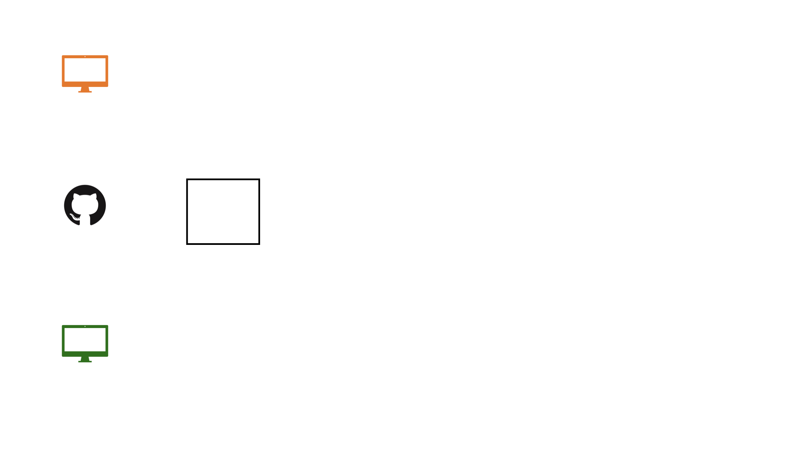
```

---

class: middle center


```{r echo=FALSE, out.width="90%"}
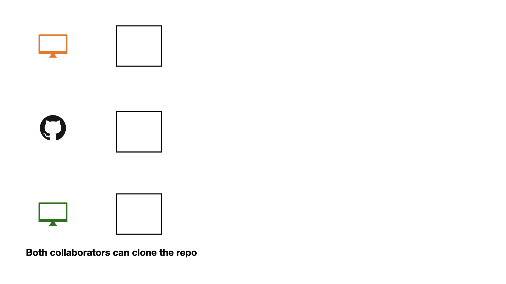
```

---

class: middle center


```{r echo=FALSE, out.width="90%"}
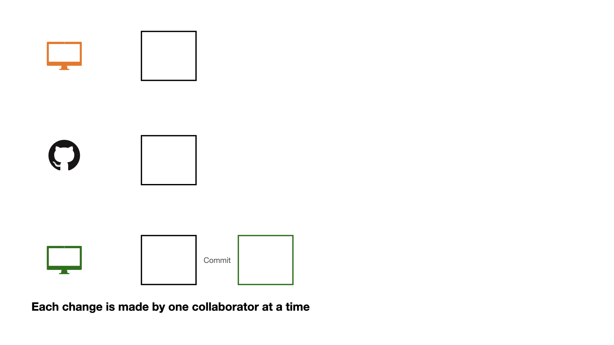
```

---

class: middle center


```{r echo=FALSE, out.width="90%"}
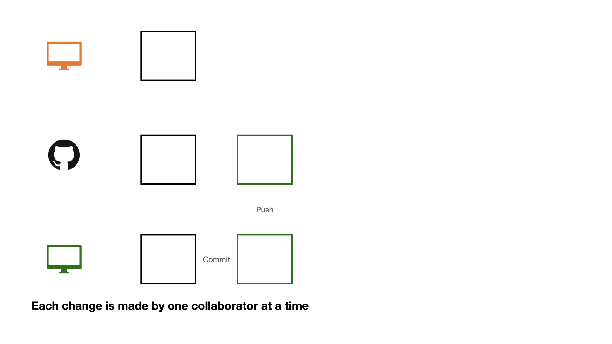
```

---

class: middle center


```{r echo=FALSE, out.width="90%"}
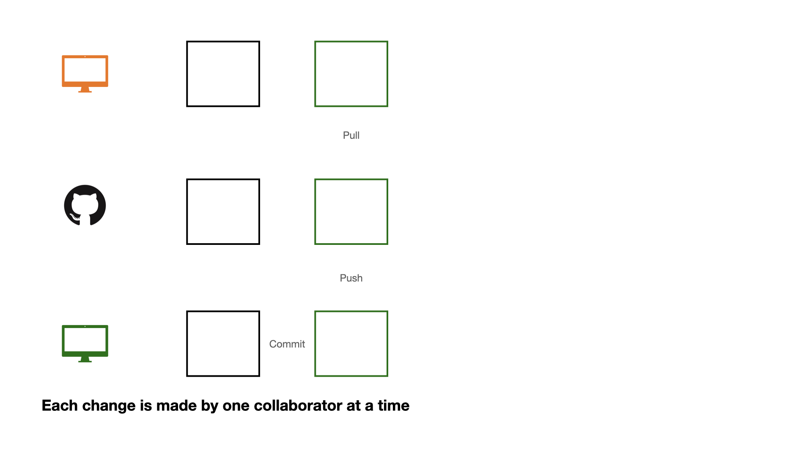
```

---

class: middle center


```{r echo=FALSE, out.width="90%"}
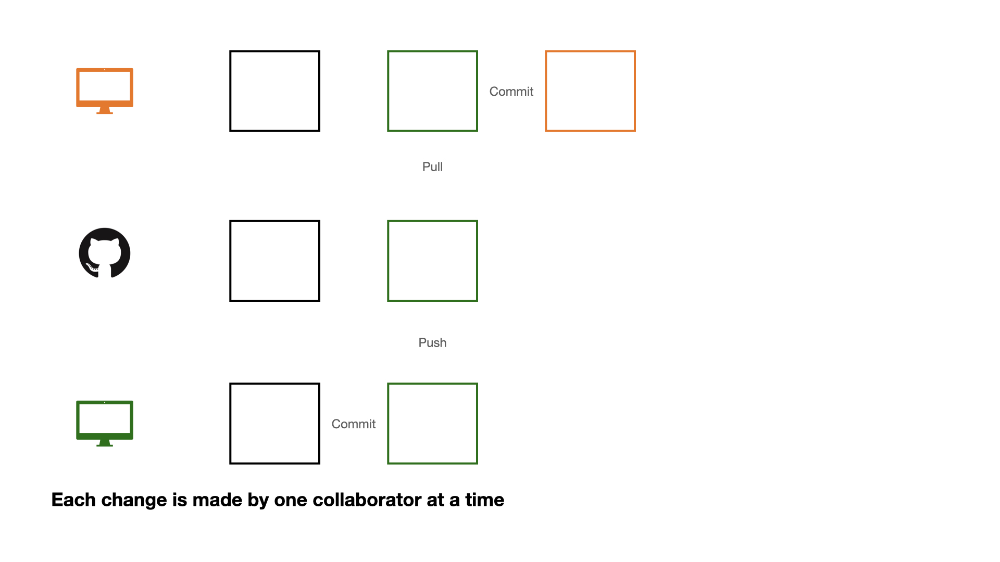
```

---

class: middle center


```{r echo=FALSE, out.width="90%"}
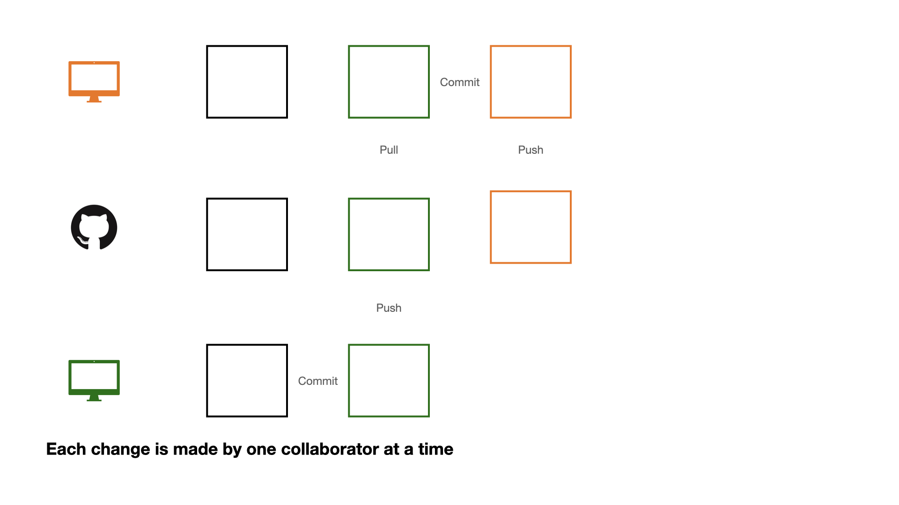
```

---

class: middle

If each change is made by one collaborator at a time, this would not be an efficient workflow. 

---

---

class: middle center


```{r echo=FALSE, out.width="90%"}
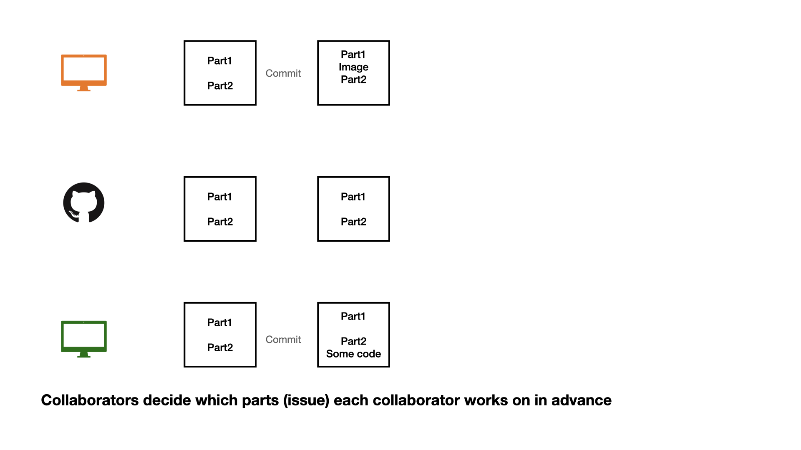
```

---


class: middle center


```{r echo=FALSE, out.width="90%"}
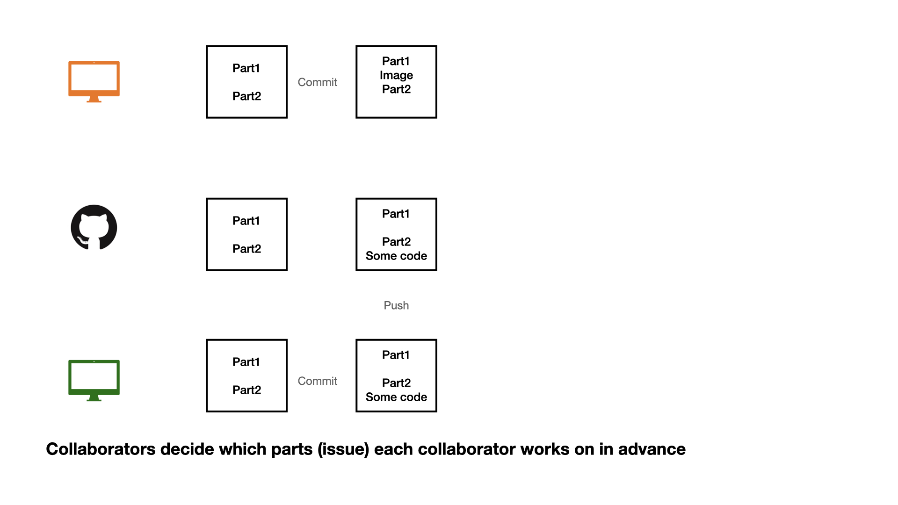
```

---


class: middle center


```{r echo=FALSE, out.width="90%"}
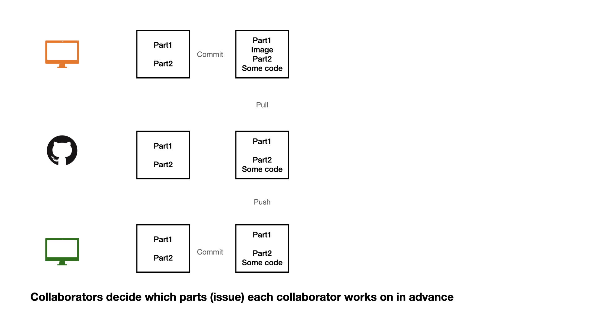
```

---


class: middle 


1 - commit

2 - pull (very important)

3 - push


---


class: middle center


```{r echo=FALSE, out.width="90%"}
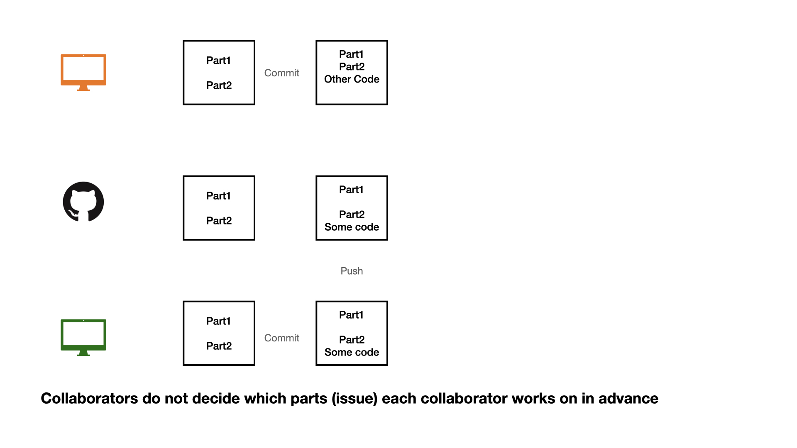
```


---


class: middle center


```{r echo=FALSE, out.width="90%"}
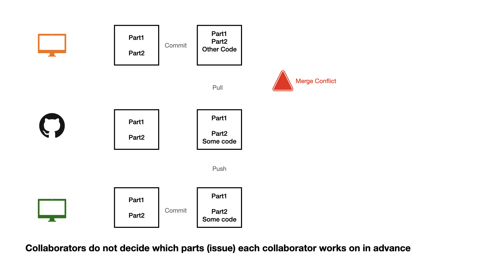
```


---

---


class: middle center


```{r echo=FALSE, out.width="90%"}
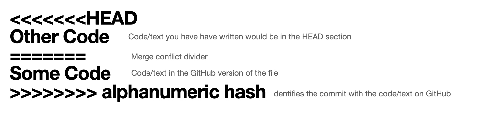
```


---

## Opening an issue

```{r echo=FALSE, out.width="80%"}
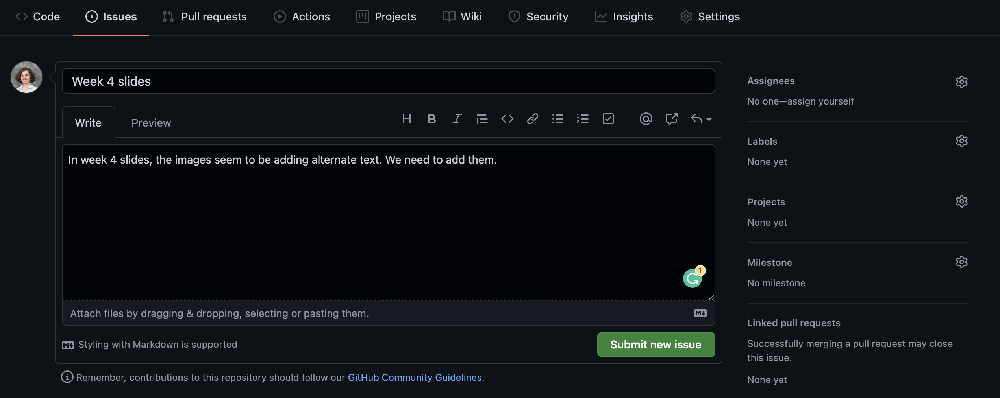
```

We can create an **issue** to keep a list of mistakes to be fixed, ideas to check with teammates, or note a to-do task. You can assign tasks to yourself or teammates. 

---

## Closing an issue

```{r echo=FALSE, out.width="80%"}
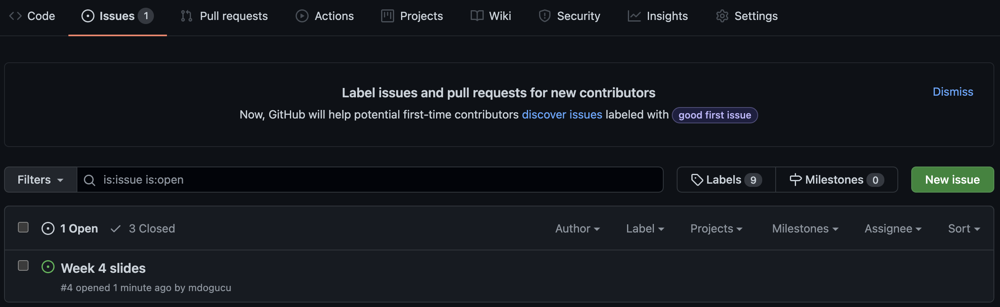
```

If you are working on an issue, it makes sense to refer to issue number in your commit message (e.g. "add first draft of alternate texts for #4"). 
If your commit resolves the issue then you can use key words such as "fixes #4" or "closes #4" to close the issue. 
Issues can also be manually closed.

---

It is also a good practice to save session information as package versions change, in order to be able to reproduce results from an analysis we need to know under what technical conditions the analysis was conducted.

```{r}
sessionInfo()
```

---

class: middle

A better way to keep track of package versions, system settings during compiling a project is by using `renv::snapshot()`. This function will create a `renv.lock` and will take a snapshot of packages to be stored in this file. 

---

class: middle

Even a better approach for reproducible versions would be using [Docker](https://jsta.github.io/r-docker-tutorial/).


